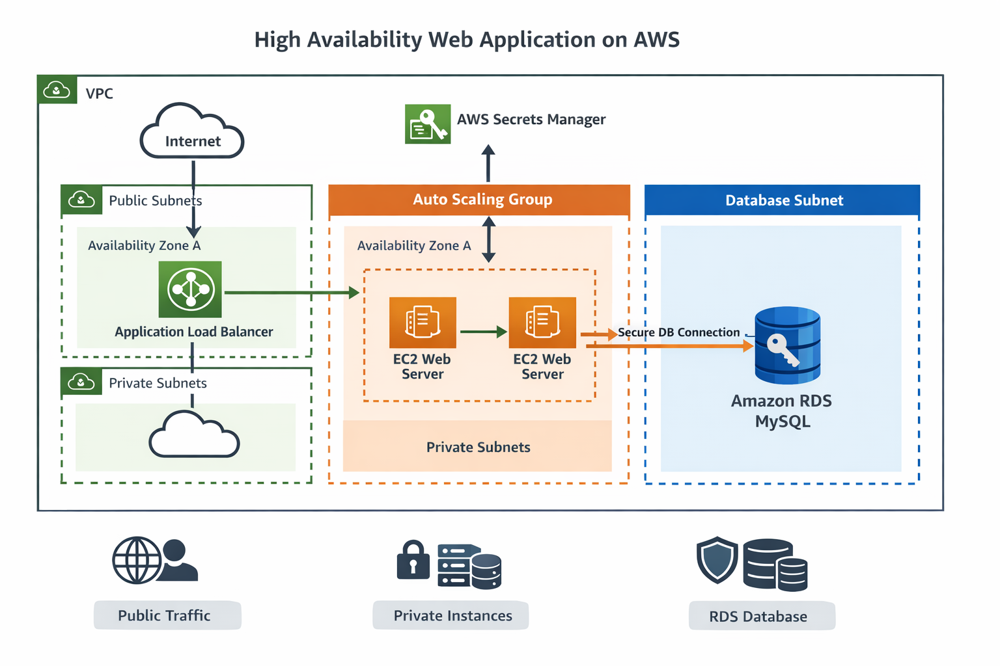

# AWS Academy Cloud Architecting 3 – Capstone Project

## 📌 Overview
This project implements a **secure, highly available PHP web application** on AWS using architectural best practices.  
The solution was designed to address scalability, availability, and security challenges for a data-driven website backed by a MySQL database.

The application is deployed across multiple Availability Zones, uses an Application Load Balancer for traffic distribution, an Auto Scaling Group for elasticity, and Amazon RDS for managed database services. Database credentials are securely stored and accessed using AWS Secrets Manager.

---

## 🎯 Objectives
- Deploy a highly available web application across multiple AZs
- Secure backend systems using private subnets and security groups
- Migrate a MySQL database from EC2 to Amazon RDS
- Store and retrieve database credentials securely using AWS Secrets Manager
- Enable automatic scaling based on application load
- Prevent direct public access to application servers and the database

---

## 🏗 Architecture Overview
The solution follows a **three-tier architecture** within a single AWS Region:

### Public Layer
- Application Load Balancer (ALB)
- Deployed across multiple public subnets
- Accepts anonymous HTTP traffic

### Application Layer
- Auto Scaling Group with EC2 instances (t2.micro)
- Deployed in private subnets across multiple Availability Zones
- Hosts a PHP web application
- Instances launched using a preconfigured Launch Template

### Database Layer
- Amazon RDS MySQL
- Deployed in private database subnets
- Not publicly accessible
- Access restricted to application servers only

### Security & Configuration
- AWS Secrets Manager for database credentials
- Security Groups enforce least-privilege access
- No public IPs on EC2 instances
- Only the ALB is internet-facing

---

## 🔐 Security Design
- EC2 instances run in private subnets without public IPs
- RDS database is not publicly accessible
- Security Groups restrict:
  - HTTP access to ALB only
  - Application traffic to ALB → EC2
  - Database access to EC2 → RDS (port 3306)
- Database credentials are never hardcoded and are retrieved securely at runtime

---

## ⚙️ Implementation Steps
1. Created an Amazon RDS MySQL database using private subnets
2. Stored database credentials in AWS Secrets Manager
3. Deployed an Application Load Balancer across public subnets
4. Created an Auto Scaling Group using a Launch Template
5. Migrated MySQL data using an SQL dump file
6. Validated application functionality through the ALB endpoint

---

## 🧪 Verification & Testing
- Accessed the application via ALB DNS name
- Executed database queries from the PHP web interface
- Verified healthy targets in the ALB target group
- Confirmed EC2 instances distributed across multiple AZs
- Ensured no public access to backend resources

---

## 📈 High Availability & Scalability
- Multi-AZ deployment
- Load-balanced traffic
- Auto Scaling based on CPU utilization
- Fault-tolerant design with no single point of failure

---

## 🧾 AWS Services Used
- Amazon EC2
- Auto Scaling
- Application Load Balancer
- Amazon RDS (MySQL)
- AWS Secrets Manager
- Amazon VPC
- IAM

---

## ⚠️ Limitations & Future Improvements
- Add HTTPS using ACM
- Enable AWS WAF for additional protection
- Enable Multi-AZ RDS for database high availability
- Add CloudWatch dashboards and alarms
- Implement CI/CD pipeline using GitHub Actions or AWS CodePipeline

---

## ✅ Outcome
This project demonstrates real-world AWS cloud architecture skills aligned with **AWS Solutions Architect Associate** best practices, including security, scalability, and high availability.
